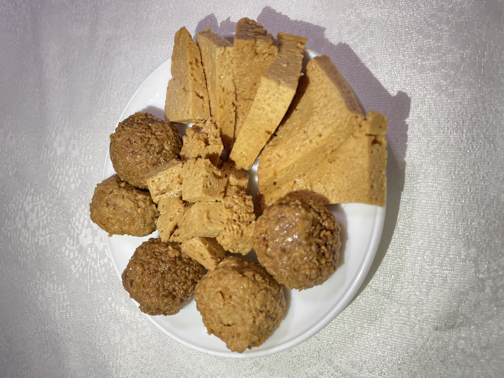

<!DOCTYPE html>
<html lang="kk">
<head>
    <meta charset="UTF-8">
    <meta name="viewport" content="width=device-width, initial-scale=1.0">
    <title>Ірімшік Сатылады - Казахский сыр</title>
    
</head>
<body>

<header>
    <h1>Ірімшік Сатылады</h1>
    
Дәмді, табиғи қазақтың дәстүрлі ірімшігі

</header>

<nav>
    <a href="index.html">Басты бет</a>
    <a href="about.html">Иримшик туралы</a>
    <a href="#gallery">Галерея</a>
    <a href="#contact">Байланыс</a>
</nav>

<section id="about">
    <h2>Ірімшік дегеніміз не?</h2>
    
 Ірімшік — қазақтың дәстүрлі сүт өнімдерінің бірі, ол сүттен дайындалып, ерекше дәмі мен құрамымен ерекшеленеді. Бұл өнім қазақтың ұлттық тағамы ретінде белгілі және денсаулыққа пайдалы көптеген қасиеттерге ие.

</section>

<section id="gallery">
    <h2>Галерея</h2>
    
    
    
</section>

<section id="contact">
    <h2>Байланыс</h2>
    
Бізбен байланысыңыз және табиғи ірімшік сатып алыңыз!

    
Телефон: +7 (777) 539-9956

    
Email: irimshik@gmail.com

    <a href="mailto:irimshik@gmail.com" class="button">Тапсырыс беру</a>
</section>

<footer>
    
&copy; 2024 Ірімшік Сатылады. Барлық құқықтар қорғалған.

</footer>

</body>
</html>
